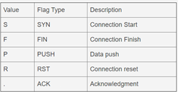

# Analýza síťového provozu

#### <u>**Úvodní pojmy**</u>

**Komunikační protokol je množina pravidel, která určují syntaxi a význam jednotlivých zpráv při komunikaci**

-   **Protokol IPv4**
    -   Protokol síťové vrstvy (3. vrstva), packet-switched network (Cesta paketů se nestanoví předem, ale pakety hledají během cesty nejkratší cestu -- **best-effort** služba)
    
    -   **Neřeší kontroly** (pořadí paketů, duplicity apod.) pouze **checksum** hlavičky IP paketu, klasické podoby IP adres (172.168.0.1 apod.)
    
    -   Plánovaný přechod na **IPv6 - má 1028x více adres**
    
    -   Pro mapování IP adres a MAC adres slouží ARP (2.vrstva)
    
-   **TCP/IP**
-   Transportní protokol (4. vrstva), **poskytuje KONTROLY** = spolehlivé doručení dat ve správném pořadí, přeposlání ztracených paketů apod.
    -   Oproti UDP, tak **TCP vyžaduje navázání spojení** před začátkem přenosu dat (TCP Handshake) = spolehlivost
-   **Typické služby:** DNS, FTP, SSH, SMTP, POP

-   **UDP**

    - **Nezaručuje správné doručení**, jeho spolehlivost mohou zajistit pouze vyšší vrstvy

    - Oproti TCP vhodný pro jednoduché aplikace, pro něž je důležité **doručení paketů v určitém čase** - vhodný pro servery s krátkými dotazy z velkého množství klientů

    - **Typické služby:** DNS, NTP, DHCP, SNMP, voice over IP
    
      

#### <u>**TCPdump**</u>

-   Nástroj příkazové řádky pro monitorování a správu sítě, který zachytává TCP/IP pakety v reálném čase, vznik 1987

-   Využívá knihovnu libpcap k zachycení a zpracování paketů

-   Spuštění bez přepínače = vypisuje informace o zachycených paketech na standardní výstup, přepínače umožňují ukládání nebo čtení paketů, filtry omezující vstupní data nebo zachytit přesný počet paketů.

-   Jeho **Windows varianta = WinDump**

-   Pcap soubor - output tcpdumpu lze otevřít ve Wireshark - dobré propojení

-   Nejčastější využití tcpdump a jejich syntaxe:
    -   `tcpdump -i eth0` - Zachytává vše na konkrétním interface (`ip link show` nebo `tcpdump -D`)
    -   `tcpdump -c 5 -i eth0` - Zachytne prvních 5 paketů
    -   `tcpdump -w 0001.pcap -i eth0` - Zapíše do souboru 0001.pcap
    -   `tcpdump -r 0001.pcap` - Přečte, co je v souboru
    -   `tcpdump -i eth0 port 22` - Určení portu
    -   `tcpdump -i eth0 src 192.168.0.2` - Pouze z nějaké IP adresy

**Porozumění output formátu**

`08:41:13.729687` `IP 192.168.64.28.22` > `192.168.64.1.41916`: `Flags [P.]`, `seq 196:568`, ack 1, `win 309`, options [nop,nop,TS val 117964079 ecr 816509256], `length 372`

- Časová známka (Timestamp)  
- Zdrojová IP adresa
- Cílová IP adresa + PORT

-   **Vlajky (Flags)**

- Sekvenční číslo dat obsažených v paketu

-   Window size - Představuje počet bytů dostupných v přijímací vyrovnávací paměti
-   Délka paketu (Packet length)  - Velikost payloadu v bytech

#### <u>**Wireshark**</u>

-   Program pro analýzu provozu v počítačových sítích, open source
-   Je velmi podobný jako tcpdump, ale nabízí navíc stovky analyzerů komunikačních protokolů, GUI a filtrů zobrazených informací
-   V paketech se dá velmi jednoduše hledat pomocí klíčových slov o protokolech, portech či jakékoliv jiné informaci, kterou paket obsahuje (viz výše sekce <u>output formátu TCPDump</u>)
-   Aplikace umí **přepnout síťovou kartu do promiskuitního režimu** (režim, kdy karta naslouchá i například broadcastu a jiné komunikaci nepřímo určenými pro ni) a díky tomu dokáže zachytávat veškerou komunikaci na připojeném médiu
-   Existuje i bez GUI (TShark)
-   Wireshark, stejně tak jako TCPDump využívá **knihovnu pcap**, což znamená, že může zachytávat pouze typy paketů, které pcap podporuje
-   **Možnost pakety v programu upravovat, živě zachytávat provoz a zpětně analyzovat**
-   **Wireshark je dostupný jak pro Linux tak také pro Windows a MacOS**
-   Zdroje na učení se s Wiresharkem: 
    -   <https://www.wireshark.org/docs/wsug_html_chunked/ChapterIntroduction.html>
    -   <https://gitlab.com/wireshark/wireshark/-/wikis/home>

-   **Další alternativy (podobné programy):**
    -   SolarWinds

    -   CloudShark

    -   Omnipeek

    -   Ettercap
-   <u>Kdo může vidět všechny přenášená data?</u> - program `traceroute` - Ukáže kudy pakety razí cestu
