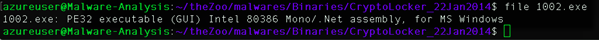
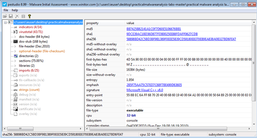
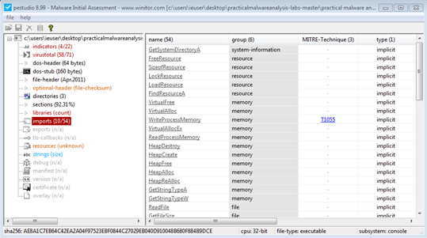
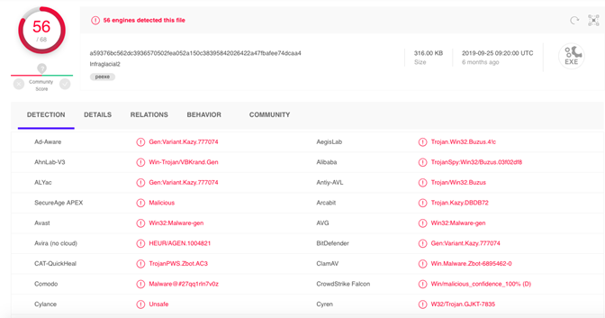
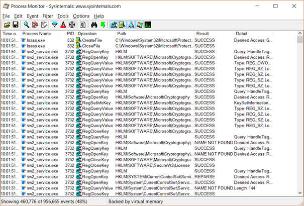

# Analýza škodlivého softwaru

Analýza škodlivého softwaru je proces určení původu a potenciálního dopadu určitého malware. Analýza umožňuje lépe porozumět tomu, jak malware funguje a co lze udělat k odstranění těchto hrozeb. Analýza může mít různé cíle: pochopení rozsahu infekce malware, poznání důsledků napadení malwarem, identifikace povahy malware apod. Existují dva typy analýzy škodlivého softwaru: **Statická analýza a dynamická analýza**.

Dříve cíle malware byly zcela neškodné. Jednalo se pouze o žertíky zkušených programátorů na vystrašení přátel, ale s časem se začalo těchto technik zneužívat a nyní jde především o zisk peněz z ukradených dat a nebo přímo z účtů lidí.

#### Základní druhy malware

**Ransomware** - Šifruje uživatelská data a za jejich odšifrování požaduje výkupné. Výkupné se platí ve virtuální měně. Tento vir se šíří jak přes email, kde ho můžeme stáhnout v příloze, tak na webových stránkách apod. Nejznámnějším ransomwarem je WannaCry.

**Worm** - Nejčastější druh, který dokáže šířit sám sebe - převezme kontrolu nad sítí

**Botnet** - Síť mnoha počítačů napadených malwarem. Většinou je pak taková síť zneužita k vykonávání DDoS útoků apod.

**Adware** - Ve většině případech není nebezpečný, jelikož útočník získává peníze tím, že se na počítači oběti neustále objevují reklamy

**Spyware** - Využívá internetové stránky pro svůj příjem dat (hesla, reklamy). Například keylogger.

**Trojský kůň** - Malware, který se vydává za jiný program nebo je součástí jiného programu, většinou vzniká uživatelskou chybou při stažení a spuštění z neoficiálních zdrojů (např.: stahování ze Slunečnice)

#### **Principy statické analýzy**

-   Získávání dat o softwaru bez jeho spouštění

-   Pokud je software obfuskovaný je velmi složité staticky analyzovat škodlivý software

-   **Obfuskace** = Proces při kterém se textová a binární data mění na nečitelná, aby byla lépe skryta pro analýzu kódu a zabránění následnému zjištění jeho funkcionality apod.

- **Data která získáváme:**

  - **Filetype:** Zjištění druhu souboru nám pomůže při hledání operačního systému, pro který je škodlivý software napsán

    -   **Příkaz:** `file <malware>`

    

  - **Strings:** Získání řetězců (stringů) z škodlivého software nám dá zbylé informace o něm a jeho funkcionalitě (IP Adresy, spouštění funkcí, error zprávy, komentáře atd.)

    -   **Příkaz:** `strings <malware>`

  -   **Hashes:** Hashováním softwaru můžeme získat jeho unikátní identifikátor.

      -   Příkaz: `md5sum <malware>`, `sha1sum <malware>`, `sha256sum <malware>`

      - Použití výstupu hashovací funkce jako identifikátor v databázi pro analýzu malware 

        
      

- **PE Studio:**

  -   Software na prozkoumávání **PE headers** (PE soubor se skládá z počtu **headers** a sekcí které říkají jak mapovat soubor do paměti)

  - **PE** = *Portable Executable* je souborový formát pro spustitelné soubory, objektové soubory a dynamické knihovny používány ve 32b a 64b verzích operačního systému Windows

  - **PE headers** nám můžou poskytnout více informací o malware

    

  -   **Timestamps** - Představa o času kompilace softwaru

  - **Imports /Exports** - Představa o funkcích a schopnostech malware

    

    

- **Využití online nástrojů**

  - Pro analýzu škodlivého softwaru také existuje mnoho online nástrojů (**VirusTotal**)

  - Vytvoří otisk souboru a prohledá databázi zda už nebyl identifikován tento otisk (soubor) jako škodlivý

  - Provede jak statickou tak dynamickou analýzu škodlivého softwaru a vypíše nalezené podrobnosti o jeho chování a funkcionalitě

    

    

#### **Principy dynamické analýzy**

- Analýza chování softwaru po spuštění

- Vyžaduje bezpečné prostředí => virtuální stroj => sandbox

- Používáme snapshoty (snímky) virtuálního stroje, abychom se mohli vrátit do stavu před spuštěním škodlivého souboru, či do jiných časových rovin

-   **Monitorujeme chování softwaru jako jsou:**

    -   Síťový provoz

    -   Kontrola přidaných či odstraněných souborů

    -   Prohlížení úprav v registru a podobně

    -   Zavedení změn v systému (např. registrace v autostartu)

- Dynamická analýza je prostředkem ke sledování specifických druhů chování systému napadeného malware

- **Obfuskované** (packed) soubory jsou zpracovány stejně jako všechny ostatní

- Rizikem dynamické analýzy je samotné spuštění malware. Je možné, že malware unikne virtuálnímu počítači tím, že využije jeho zranitelnosti, a proto je třeba důsledně aktualizovat virtualizační nástroj

  - **Pro zamezení úniku se doporučuje** zakázat sdílené složky, či přepnout do Host-only mode, také vypnout Windows defender / firewall na virtuálním stroji - ověření `nmap -PN` + antivir na fyzickém stroji, prostředí odpojeno od Internetu

    

-   **Software používaný k dynamické analýze:**

    - **ProcMon** (Nástroj pro Windows, který zobrazuje souborový systém v reálném čase, registr a aktivitu procesů/vláken)
    
      
    
-   Tak jako malware analytici zlepšují své metody detekce malware, autoři malware zase neustále hledají nové způsoby, jak zabránit detekci a analýze jejich škodlivých kódů. Jedním ze způsobů, jak toho malware autoři dnes dosahují je použití nejrůznějších druhů **evasivních technik (např.: obfuskace).**

    -   [Kvalitní magisterská práce](https://theses.cz/id/xm4egv/DP_Kovar_Jaroslav_2019.pdf)
