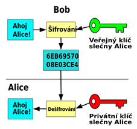
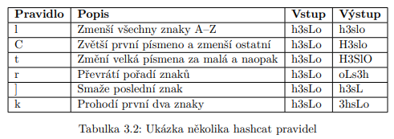
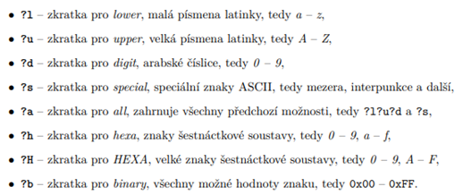
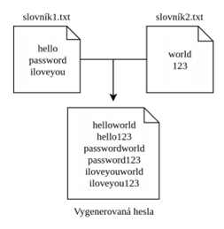
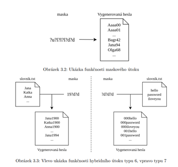

# **Asymetrická kryptografie** a hashovací funkce

### <u>Asymetrická kryptografie</u>

##### Rozdílnost oproti symetrické kryptografii

-   Oproti symetrické, tak nevyužívá pro zašifrování a dešifrování stejný klíč.

-   Používá **Veřejné klíče** (zašifrování) a **Privátní** (dešifrování)

##### Princip fungování

- Každý člověk má nějaký svůj **veřejný klíč**, takže mu kdokoliv může poslat zašifrovanou zprávu

- Poté na tuto zprávu pasuje pro **dešifrování pouze privátní klíč**, který vlastní pouze ten daný člověk a drží ho v tajnosti

- Tyto dva klíče jsou k sobě **matematicky svázané**

-   Funguje na principu **jednocestných funkcí** = operace, které lze provést pouze v jednom směru

    -   Vstup -\> jednoduše výstup

    -   Výstup -\> nemožné zpět zjistit vstup

- Jako násobení - Vynásobit 2 čísla je jednoduché, ale zjistit jaké dvě to byly je složitější

  

##### Využití

-   Šifrování zpráv

-   Digitální podpisy

-   **Elektronický podpis se používá:**

    - Datové schránky, zasílání dokumentů v rámci vládních institucí (DPH, Daňové portály, výpisy z Rejstříků trestů apod.)

    - Komunikace s ČNB (cenné papíry)
    
      

##### Příklady algoritmů

-   **RSA**

    -   Vznik v roce 1977, první **vhodný pro elektronický podpis a i šifrování zpráv**

    -   Bezpečnost postavena na předpokladu, že rozložit velké číslo na součin prvočísel je velmi obtížná úloha **(faktorizace)**

    -   Generuje dvě dostatečně velká prvočísla, zhruba stejně dlouhá, jejich součin je modulem pro oba klíče a poté využívá tzv. **Eulerovy funkce**

    -   **Používá se dodnes**, při dostatečné délce klíče je stále bezpečný

-   **DSA**

    -   Pouze k digitálnímu podpisu, nelze využít pro šifrování dat

    -   Navržen v roce 1991 v Americe, součást standardu DSS

- **El-gamal**

  - Také součástí standardu DSS

  - Založený na počítání diskrétních logaritmů

  - Klíče obdobných velikostí jako u RSA

  - Nevhodný pro klasické šifrování (šifrovaný text 2x větší než otevřený text)

    

##### Výhody a nevýhody

+ + Neodesílá se klíč pro dešifrování, takže nemůže dojít k jeho vyzrazení, zároveň veřejný klíč je dostupný, takže jednoduchý způsob odeslání zpráv příjemci

+ + Je třeba méně klíčů než u symetrických metod -- pro komunikaci několika osob postačí pro každou osobu jen jeden pár klíčů

-   - 1000x pomalejší než symetrické

- - Ověření pravosti klíče - identifikace majitele veřejného klíče (certifikační úřady)

  

### <u>**Hashovací funkce:**</u>

**Princip fungování**

-   Matematická funkce (algoritmus) pro převod vstupních dat do relativně malého čísla, výstup je vždy stejně dlouhý a malá změna na vstupu vždy vyvolá velkou změnu na výstupu. Každá zpráva tvoří unikátní hash a zpětné zjištění zprávy je téměř nemožné.

-   Výstup se označuje za **otisk, fingerprint, hash**

- **Využití:** Zajištění integrity dat, ochrana uložených hesel, bioinformatika, odhalování duplicitních záznamů, hledání malware v antivirových databázích

  

**Jaké jsou důležité vlastnosti, podle kterých vybíráme adekvátní funkci:**

-   Záleží na složitosti hashovací funkce a její časové náročnosti. Mnoho hashovacích funkcí je takových, aby nezabraly mnoho času, ale jejich bezpečnost je mnohem slabší a uhádnout například heslo by bylo mnohem jednodušší. Naopak například titulky nebude nutné šifrovat extra bezpečnou funkcí, ale spíše rychlou.

- **Hashovací funkce pro bezpečné ukládání hesel**

  - Dříve SHA-1, ale s časem zranitelné, tudíž nyní **SHA2**

  -   **SHA-256 / SHA-512** je nejčastější pro zašifrování hesel, ovšem nyní od roku 2015 existuje také SHA-3, které ale ještě není velmi využíváno
  -   <u>SHA2</u>
  -   Číslo za SHA značí počet bitů, které jsou výstupem
      
  -   Používané taky například u Debianu pro proces autentikace
      
  -   Vychází z SHA1
      
  -   **SHA3 nevychází z SHA2**
  -   Také je využíváno občas bcrypt a scrypt

- **Hashovací funkce pro jednoduchou operaci jako například výběr titulků k filmu:**

  - <u>MD5</u>

  -   Zastaralé, produkuje 128 bitů

  -   Nyní se využívá na jednodušší operace - ověření integrity dat nebo checksum, v rámci kryptografie téměř nevyužívaný, jelikož vznikaly **<u>kolize</u>** (Situace, kdy dva různé soubory / vstupy vytvoří stejný výstup. Pravděpodobnost kolize je 2^délka hashe) a jeho bezpečnost byla prolomena

  -   Je jednoduchý, proto je také vhodný pro titulky

  -   <u>SHA1</u>
      -   Zastaralé produkuje 160 bitů, předchůdce SHA2
      -   Je bezpečnější než MD5, ale zase trvá déle

- **Hashovací funkce pro porovnání otisku souboru s databází malware antiviru**

  - Všeobecně se nedoporučuje malware porovnávat pouze pomocí hashů, **jelikož tento způsob již je zastaralý**, ovšem stále se jedná o jednu z dobrých analyzačních technik (např.: VirusTotal)

  - MD5 a SHA1 jsou nevhodné, protože může přijít na kolize, jinak by jejich výhodou byla vyšší rychlost

  - Nyní se doporučuje SHA256 nebo SHA3, ačkoliv trvají déle

    

**Jaké jsou používány strategie pro prolamování hashů:**

-   **Rainbow tabulky**

    -   Využívají k útoku **předem vypočtené hodnoty k usnadnění prolomení** hashovací funkce, používané pro hesla (nemusí se počítat hash při lámání hesla = nižší časová náročnost), postupně redukují (redukční funkce)

    -   Kompromis mezi náročností bruteforce a prostorovou náročností předem vypočtených tabulek pro reverzní funkci k hashovací funkci

-   **Slovníkové útoky**

    -   Bruteforce pomocí předpřipraveného slovníku (rockyou.txt, únik 2017 Mall apod.)

-   **Útoky definované pravidly (`Hashcat/John the ripper`)**

    - V programu hashcat lze použít nástroj *`maskprocessor`*, který dokáže na základě masky vygenerovat pravidla

    - Alternativním způsobem je, že do separátního souboru uvádíme pravidla, kterými upravujeme slovník
    
    - Pravidla jsou standardizovaná pro všechny nástroje - stejné využití u `hashcatu` i `John the ripper`
    
      
    
      

-   **Útoky definované maskou (`Hashcat/John the ripper`)**

    - **Nahrazuje brute-force efektivnější cestou** - definuje nějaké způsoby, jak by člověk mohl vytvářet heslo - nejčastější bude například velké písmeno na začátku, nějaké jméno, poté 2 čísla apod.

    - Tyto znalosti uplatníme a mnohonásobně zkrátíme počet možností, ale musíme znát strukturu hledaného hesla

    - Např.: Heslo definované maskou, které začíná pass a pak následují 4 jakékoliv znaky `pass?a?a?a?a`

    - **Markovovy řetězce** - matematické modely pro efektivnější masky
    
    - Zkratky pro pravidla masek v hashcatu viz. níže
    
      

-   **Kombinační útoky**
-   Při spuštění poskytneme dva slovníky, jejich obsahy se kombinují a časová náročnost exponenciálně roste

-   **Hybridní útoky**
    -   Útoky, kde kombinujeme různé způsoby k sobě pro největší efektivitu

