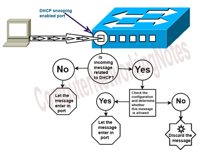

# Druhy síťových útoků

​	**Síťový útok** je pokus o získání neoprávněného přístupu k síti s cílem krást data nebo provádět jinou škodlivou činnost.

​	V případě síťových útoků rozlišujeme dva hlavní druhy a to pasivní a aktivní. Vysvětlení těchto dvou kategorií s názornými příklady útoků si rozebereme 	v této kapitole.

#### Přehled typů a druhů útoků

- **<u>Pasivní útoky</u>**

  Cílem pasivních útoků je získat nebo využít informace ze systému, nemají však vliv na systémové prostředky. Při pasivním útoku útočník pouze monitoruje komunikační kanál a ohrožuje důvěrnost dat. **Jedná se tedy o odposlouchávání či monitorování přenosu s cílem získat přenášené informace.** Tento typ útoku často přechází aktivnímu útoku. Jedná se většinou o nějaké zmapování hierarchie sítě nebo jiných informací, které poté mohou útočníkovi pomoci lépe zacílit. Na pasivní útoky je většinou téměř nemožné přijít, pokud útočník po sobě nenechá nějaké stopy (logy apod.). S jejich analyzováním mohou pomoci IDS / IPS systémy.

  -   **Nepovolený přístup:** Útočník se dostane k síti bez povolení. Většiny těchto útoků jsou příčiny typu: slabá hesla, slabá ochrana proti sociálnímu inženýrství, dříve odcizené účty. Tento druh útoku může být jak pasivní tak aktivní. Záleží pouze na útočníkovi, zda-li své poznatky zneužije či nikoliv.
  -   **AP evil twin:** Jedná se o podvodný přístupový bod (AP) k Wi-Fi, který se tváří jako legitimní, ale místo toho odposlouchává komunikaci. Celý útok se dá nazvat phishingem ve světe bezdrátových sítí. Tento druh útoku bývá pasivní.
  -   **Odposlouchávání:** Mnoho komunikace probíhá v nezabezpečeném formátu, což umožňuje útočníkovi, který získal přímý přístup k přenosu v síti, aby naslouchal a četl přenášená data. Jako obranu proti odposlouchávání je vhodné použít silné šifrovací služby založené na bezpečných kryptografických principech.

  Stejně jako odposlouchávání, tak pasivním útokem může být označována analýza provozu sítě nebo skenování portu, kdy útočník kontroluje, porty UDP/TCP, které používají síťové služby v cílovém počítači. Kontrola portů může pomoci útočníkovi určit například operační systém a mnoho jiných informací, které poté útočník zužitkuje při aktivním útoku.

  

- **<u>Aktivní útoky</u>**

  Aktivní útoky se pokoušejí měnit systémové prostředky nebo ovlivnit jejich funkčnost. Při tomto typu útoku se útočník snaží data přenášená příslušným kanálem odstranit, přidat nebo jinak měnit. **Aktivní útočník ohrožuje integritu dat, autentizaci i důvěrnost**. Součástí aktivních útoků je nějaká změna datového toku nebo vytvoření toku falešného.

  - **MITM (Man In The Middle):** Útočník zachycuje provoz mezi dvěma stranami - koncovým uživatelem a serverem. Následně může ukrást přenášená data, pokud komunikační protokoly nejsou dostatečně zabezpečené nebo měnit komunikaci mezi stranami. Tento pojem je nadřazený pro jiné útoky. <u>Nejedná se o útok samotný, nýbrž o "techniku", kterou některé útoky využívají pro své provedení.</u>

  - **Distribuované odmítnutí služeb (DDoS):** Útočníci využijí připravené skupiny botnetů (napadená zařízení) a používají je k směrování falešného provozu ve Vaší síti nebo na serverech. Například posíláním velkého množství SYN/ACK paketů, nebo velkým množstvím složitých SQL dotazů, kdy obě varianty mohou server či databázi přetížit. Tento typ útoku bývá často známý pro diváky / streamery na platformě Twitch, kdy znemožňují konkrétním streamerům vykonávat jejich práci. <u>Stejně jako MITM, tak se nejedná přímo o útok samotný, ale příkladem útoku DDoS je například NTP amplification attack</u>. Druhů je mnoho a proto doporučuji nastudovat **[tento článek.](https://www.imperva.com/learn/ddos/ddos-attacks/)**

  - **Eskalace privilegií (Privilege Escalation):** Jakmile útočník pronikne do Vaší sítě, může použít eskalaci privilegií k rozšíření jeho dosahu. Tento druh útoku může být jak pasivní tak aktivní. Záleží pouze na útočníkovi, zda-li své poznatky zneužije či nikoliv. Rozlišujeme dva základní druhy eskalace:

    - <u>Horizontální eskalace</u> = útočník získá přístup k dalším sousedním systémům (představte si to, že jste se dostali na účet klienta v bance. A poté, co jste pronikli k jeho účtu, tak eskalujete horizontálně práva i k účtům dalších klientů - nezískáváte vyšší práva, ovšem stále působíte velké škody a to stále na stejné hierarchické úrovni) 
    - <u>Vertikální eskalace</u> = útočník získá vyšší úroveň oprávněn (představte si to, že jste se dostali na účet klienta v bance. Z jeho účtu se Vám povedlo eskalovat na vyšší úroveň v hierarchii - máte přístup administrátora)

  - **ARP Spoofing**: Jedná se o útok, kdy útočník zneužívá ARP protokolu a je takzvaným MITM (viz. výše). Útočník podvrhne odpověď na ARP dotaz a vydává se za jiný počítač v síti. Následně může pakety směřované oběti směrovat na svůj počítač, nebo v opačném směru, pakety od oběti posílat přes sebe.

  - **DHCP Starvation + Rogue:** Útok, který se zaměřuje na DHCP servery. Při útoku dochází k zaplavení DHCP serveru DISCOVER pakety, dokud DHCP server nevypotřebuje celý pool jeho IP adres. Tím může útočník jednoduše zahltit server a následně se vydávat za falešný DHCP server, čímž docílí MITM útoku.

    

#### Vykonávání útoků a obrana proti nim

##### <u>ARP Spoofing</u>

K ARP spoofingu využijeme příkazu arpspoof. 

`arpspoof [-i interface] [-t target] host`

-   Následující příkazy musíme dělat zvlášť v jednotlivém terminálu

    -   `arpspoof -i eth0 -t 192.168.1.104 192.168.1.1` - Tímto příkazem se snažíme přesvědčit klienta (192.168.1.104) o tom, že jsme router (def. gateway, 192.168.1.1)

    -   `arpspoof -i eth0 -t 192.168.1.1 192.168.1.104` - Tímto příkazem se snažíme přesvědčit router (def. gateway, 192.168.1.1) o tom, že jsme klient (192.168.1.104)

-   Následně můžeme použít ostatní programy k zachytávání / čtení provozu mezi obětí a routerem (tcpdump, wireshark atd.)

-   **Obrana proti ARP spoofingu:**
-   **Statické ARP záznamy**: IP adresy přeložené na MAC adresy jsou staticky uloženy v ARP tabulce
    
-   **Zabezpečení portů switche:** Switch (L3) sleduje DHCP komunikaci a zjišťuje, jaké IP adresy byly přiděleny na daných portech, následně zahazuje neoprávněné ARP odpovědi
    
-   **Software detekující ARP spoofing:** Software různými způsoby detekující možný ARP spoofing, např. kontrola počtu IP adres přiřazené jediné MAC adrese, ochrana se stává zbytečnou v případě, kdy se útočník vzdá vlastní IP adresy a bude mít pouze IP adresu oběti.

<u>**DHCP Starvation**</u>

K DHCP Starvation útoku se využívá příkazu [pig.py.](https://github.com/kamorin/DHCPig)

`pig.py [-h -v -6 -1 -s -f -t -a -i -o -l -x -y -z -g -r -n -c] <interface>` - Více viz. dokumentace (odkaz výše)

-   `./pig.py eth0` - Nejjednodušší a nejčastější využití. Tímto příkazem spustíme python skript, který nám pomůže vyčerpat pool IP adres DHCP serveru přes zadaný interface (eth0). Někdy je potřeba použít fuzzing nebo jiné techniky, které pig.py nabízí, aby útok byl úspěšný. Více k danému scriptu naleznete na [gitlabu.](https://github.com/kamorin/DHCPig/blob/master/pig.py)
-   **Obrana proti DHCP starvation útoku:**
        -   **Nastavení limitu nauky MAC adres:** Je nastaven limit pro počet naučených MAC adres za určitou dobu. A tedy nemůže útočník ve chvíli vyčerpat celý pool.
    -   **DHCP snooping:** Lze nastavit pouze na switchích, funguje podobně jako firewall = kontroluje příchozí komunikaci na portu. Pokud nesouvisí s DHCP, pošle ji dál, pokud s DHCP souvisí, použije svou logiku a na základě své konfigurace komunikaci propustí, či nepropustí.

