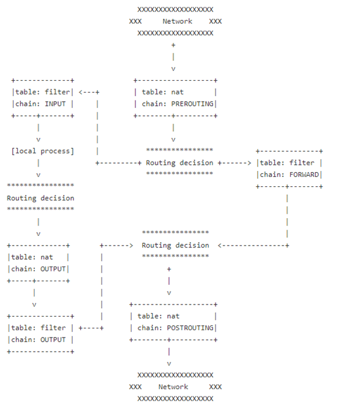

# Firewall

#### Co je firewall a k čemu slouží?

- Softwarové programy nebo hardwarová zařízení, která filtrují a zkoumají informace přicházející prostřednictvím připojení k internetu (z vnějšího světa do sítě)

-   **Hardwarový** (personální) firewall = samostatné hardwarové řešení pro ochranu počítačové sítě

    -   Malá nebo žádná konfigurace (zabudovány do hardwaru)

    -   Umístěn před vstupem do lokální sítě a tedy filtruje přístup ke všem prostředkům v dané síti

    -   Hardwarové brány firewall poskytují základní zabezpečení pro IoT, např.: chytré žárovky (často slabé funkce zabezpečení)

-   **Softwarový** (síťový) firewall = realizován na koncových stanicích (počítačích)

    -   Umístěn na samostatných počítačích

    -   Filtruje příchozí a odchozí komunikaci mezi počítačem a vnějším internetem(WAN)

    -   Více konfigurace než hardwarový firewall

    -   **Windows:** Windows Firewall, Norton 360, Avast Internet Security

    -   **Linux:** `iptables`, `nftables`

- **Bezpečnostní politika firewallu** = Nastavení pravidel pro komunikaci přes firewall (dnes už nemusí být pouze pravidla, ale i překlady adres (NAT) atd.)

- Při nastavování pravidel je dobré si určit, jak moc je síť vystavena útokům a jak moc je třeba dbát na bezpečnost. Např.: U vás doma je síť vystavena mnohem menšímu riziku, než datový server s citlivými informacemi

  

#### **Iptables**

-   Nástroj pro OS Linux, který slouží pro nastavování pravidel firewallu v jádře (kernel)

-   Příkaz **`iptables`** slouží k manipulaci s tabulkami **Xtables** (které používá [**Netfilter**](https://cs.wikipedia.org/wiki/Netfilter)) a v nich umístěných řetězců (**chains**) složených z pravidel. Pravidla slouží k ovlivňování průchodu paketů jádrem operačního systému (resp. jeho subsystémem, který nazýváme TCP/IP stack). Díky tomuto nástroji tvoříme pravidla, který průchod ovlivní (ACCEPT, DROP, RETURN apod.)

- **Tabulky:**

  - **Filter** (default) **-** Slouží převážně k filtrování

  - **Nat -** K překladu síťových adres obsahuje sady pravidel:

  - **Mangle -** Sady pravidel pro úpravy hlavičky paketů, manipulace s TTL (TimeToLive) atd.

    

- **Řetězce(chains):**

  -   **Filter:**

      -   **INPUT -** Příchozí pakety

      -   **FORWARD -** Pakety pouze procházející (pokud server funguje jako router)

      -   **OUTPUT -** Odchozí pakety

  -   **Nat:**

      -   **PREROUTING -** Modifikuje pakety před jejich zpracováním v routovací tabulce

      -   **OUTPUT -** Uplatňuje se na odchozí pakety

      -   **POSTROUTING -** Modifikuje pakety, po průchodem routovací tabulkou

  -   **Mangle:**

      - Obsahuje všech pět řetězců (sad pravidel): INPUT, FORWARD, OUTPUT, PREROUTING, POSTROUTING
      
        

- **Targets:**

  -   **ACCEPT -** Pustí paket skrz tabulku

  -   **DROP -** Zahodí paket

  -   **RETURN -** Vrátí paket do předchozího řetězce (ze kterého se paket dostal do tohoto řetězce) následujícímu pravidlu

  - **QUEUE -** Pustí paket z kernelu do userspace (pro další zpracování - musí být nakonfigurováno v kernelu)

    

-   **Targets extensions:**

    - **DNAT -** Destination network address translation

    - **LOG -** Logování do syslogu (software generující zprávy od systému)

    - **MARK -** Označování paketu

    - **MASQUERADE -** Překlad adres na adresu odchozího rozhraní (umožňuje celé síti interních IP adres pracovat přes jednu externí IP adresu a maškaráda umožňuje převod z jednoho protokolu na druhý)
    
    - **REJECT -** Odeslání chybové odpovědi na přijatý paket
    
    - **SNAT -** Source network address translation
    
      
    
- **Určení hlavní politiky při nastavování pravidel**

  1. Vše propustit a postupně zakazovat určité druhy komunikací

  2. Vše zakázat a postupně povolovat určité druhy komunikací (více bezpečné)

     

- **Nejpoužívanější Akce (tučně = časté)**

  -   **-A**, **\--append** - Přidá na konec řetězce nové pravidlo.

  -   **-D**, **\--delete** - Smaže pravidlo (zadává se buď v přesném tvaru, jak bylo zadáno nebo jeho číslem, které lze získat volbou \--lin.).

  -   **-R**, **\--replace** - Nahradí pravidlo na zadané pozici.

  -   **-I**, \--insert - Vloží na začátek řetězce nové pravidlo pokud není zadaná pozice.

  -   -L, \--list - Vypíše všechna pravidla v řetězci. Pokud řetězec není zadán, jsou vypsány všechny řetězce s jejich pravidly.

  -   -F, \--flush - Vyprázdní v řetězci všechna pravidla

  -   -N, \--new-chain - Vytvoření nového řetězce.

  -   -X, \--delete-chain - Smaže vlastní řetězec (nelze odstranit výchozí)

  -   -P, \--policy - Politika (policy) řetězce.

  -   -E, \--rename-chain - Přejmenování vlastního řetězce.

      

- **Častá definování pravidla**

  - **-p** protokol

  - **-s / -d** zdrojová adresa / cílová adresa

  - **-i** interface (input)

  - **-o** interface (output)

  - **\--sport / \--dport** zdrojový port / cílový port

    

- **Základní syntaxe**

  -   `iptables [tabulka] [akce] [chain] [match] [cíl]`

  -   **Pár příkladových příkazů:**
      -   `iptables -t filter -A INPUT -s 10.0.0.1 -j DROP`

          -   Přidá na konec pravidel nové pravidlo, tabulky filter (ta je používaná ve výchozím nastavení takže tam teoreticky nemusí být napsána) řetězce INPUT, a tedy pakety příchozí se zdrojovou adresou 10.0.0.1 budou zahozeny (-j určujeme buď ACCEPT nebo DROP)
      -   `iptables -P INPUT DROP`

          -   Nastaví hlavní politiku na DROP, tedy všechny pakety budou ve výchozím nastavení zahozeny
      -   `iptables -A INPUT -i eth0 -s 192.168.0.1 -j ACCEPT`
          -   Přidá na konec pravidel nové pravidlo. Pakety příchozí přes interface eth0 se source adresou 192.168.0.1 budou přijaty.
      -   `iptables -A INPUT -p tcp -sport 22 -i eth0 -s 192.168.0.1 -j ACCEPT`
          -   Přidá na konec pravidel nové pravidlo. Pakety příchozí přes port TCP se zdrojovým portem 22 a interface eth0 se source adresou 192.168.0.1 budou přijaty
      -   `iptables-save -f /etc/iptables/iptables.rules`
          -   Uloží pravidla
      -   `iptables-restore /etc/iptables/iptables.rules `
          -   Obnoví pravidla

  

  

- **Nftables**

  -   **Rozdíly oproti iptables:**
      -   **`nftables`** je nástupce **`iptables`**
      
      -   Občas podobný v syntaxi
      
      -   nftables obsahuje práci s ipv6 a arp tabulkami v jednom nástroji (nftables) zatímco samotné iptables neobsahují práci s ipv6 nebo arp
      
      -   **Tabulky a řetězce** nejsou předem nadefinovány => možnost mít vlastní počet tabulek a řetězců (jsou volně konfigurovatelné)
      
      -   Pravidla mohou být kombinována a může být provedeno více akcí v jednom pravidlu
      
      -   Je rychlejší
      
  -   **Rozdíl v syntaxi:**
  -   Např. Chceme zahodit všechny pakety s cílovou adresou 1.2.3.4
      
      -   **<u>nftables</u>**: `nft add rule ip filter output ip daddr 1.2.3.4 drop`
      
      -   **<u>iptables:</u>** `iptables -A OUTPUT -d 1.2.3.4 -j DROP`
