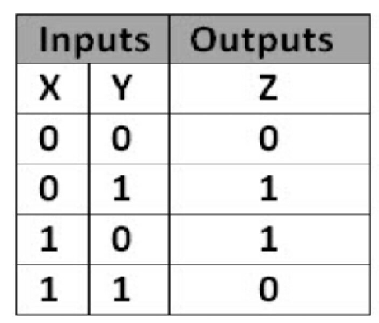
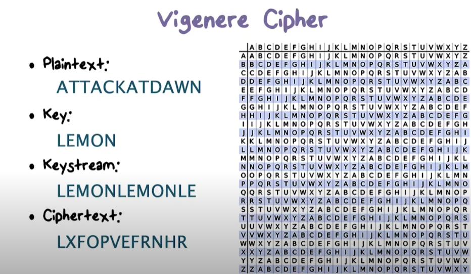
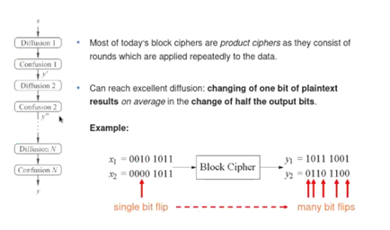
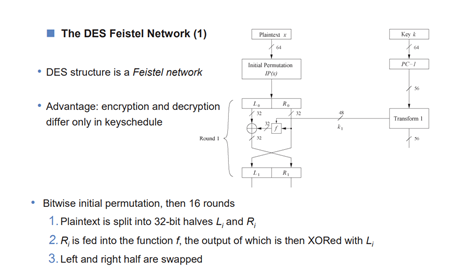
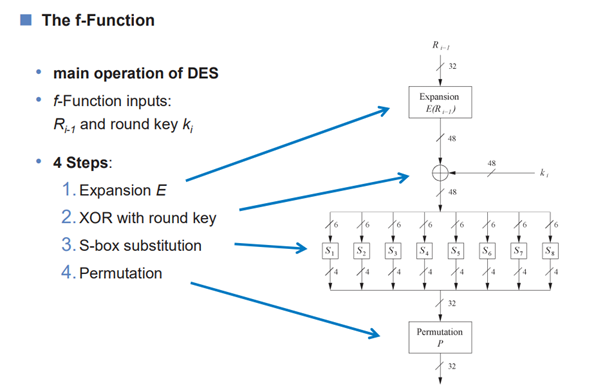
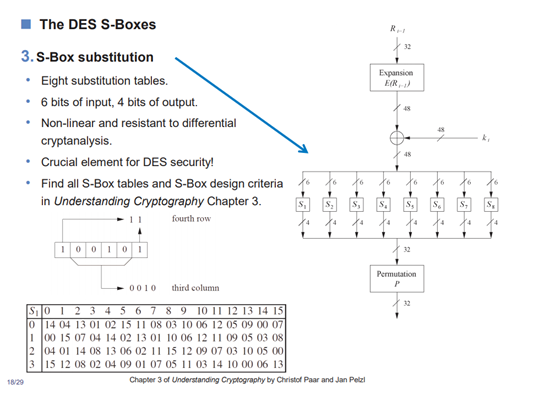

# Kryptografie

Kryptografie (šifrování) je nauka o metodách utajování smyslu zpráv převodem do podoby, která je čitelná jen se speciální znalostí.

Každá dobrá šifra musí splňovat tyto 3 požadavky:

1. **Důvěrnost =** Informace přístupné jen tomu, kdo je oprávněn se s nimi seznamovat
2. **Integrita =** Žádná modifikace informací po odeslání autorem

3. **Autenticita =** Data skutečně pochází z uváděného zdroje

Každá šifra má také svůj maximální počet řešení / všechny možné způsoby klíčů se nazývají **keyspace** (např. PIN Kreditní karty má keyspace o velikosti 10000)

Perfektní nástroj na kryptografii je [CyberChef](https://gchq.github.io/CyberChef/). Obsahuje mnoho funkcí, které mohou pomoci při dešifrování nebo šifrování a pochopení určitých algoritmů. [Dokumentace CyberChefa](https://github.com/gchq/CyberChef)


#### **Starověké šifry**

- **Nejstarší způsoby šifrování** 
  - Počátky šifrování a snaha uchovávat informace sahá hluboko před náš letopočet (cca. 4500 př. n. l.)
  - Starověká kryptografie využívala mnoho originálních způsobů, jak skrývat informace. Typické jsou hliněné tabulky, kožené proužky, které nedávaly smysl, pokud nebyly přiložené na šestihranu a nebo dokonce i využívání poslů, kterým se vyholila hlava, napsal se tajný vzkaz a počkalo se než vlasy opět narostou. Časté také například byla zpráva zabalená ve voskové kuličce, spolknuta poslem a poté vyzvracena na místě určení.

- **Základy kryptografických algoritmů**

  - **Kama sutra** - Starověká kniha popisující 64 dovedností, které by měla žena umět (šachy, tesařina, vařit, **umění šifrovat na 49. místě**) -> **Kamasutra Cipher** - Funguje na principu abecedních dvojic, kdy každé písmeno má svůj protějšek 1:1, dvojice stojí pod sebou

  - **Césarova šifra** - Funguje na principu substituce - všechna písmena jsou během šifrování zaměněna za písmeno, které se abecedně nachází o pevně určený počet míst dále v abecedě.

  - **Vigenérova šifra / Vernam šifra** - Máme výchozí text a klíč, a o jejich rozdíl abecedních pozic posuneme výchozí text v abecedě. Cílem této šifry bylo znemožnit frekvenční analýzu jelikož se tímto četnost více rozprostře - není pevně daný posun všech písmen, ale mění se dle klíče pro dané písmeno.

  - **XOR** - Šifrování pomocí XOR (Exkluzivní disjunkce) - Písmena převedena na 8-bit ASCII a klíč v 8-bit ASCII jsou společně pomocí metody XOR zašifrovány.

    

    ```
    Např.:
    01010111 01101001 01101011 01101001
    11110011 11110011 11110011 11110011
    -----------------------------------
    10100100 10011010 10011000 10011010
    ```

    

- **Způsoby ukrývání:**
  - **Transpozice** (Mění pořadí a místo písmen, většinou vychází z nějakých grafických tabulek apod), - **ENIGMA, VIGENERE**

  - **Steganografie** (Skrytí zprávy bez šifrování, ale těžko nalezitelná), - **DIGITÁLNÍ** (změny barevných bitů jako ASCII apod.), **NEVIDITELNÉ INKOUSTY** (Viditelné například pouze pod UV světlem)

  - **Substituce** (Pořadí nehraje roli, znaky jsou nahrazované za jiné písmeno, dle nějakého pravidla) - **CÉSAROVA ŠIFRA**




#### **Symetrické kryptografické algoritmy**

Do dob světových válek nebyla kryptografie příliš důležitá a zájem o ní byl minimální, ovšem především díky 2. světové válce se o tuto vědní disciplínu začalo zajímat čím dál tím více lidí, hlavně díky šifře **Enigma**. Z vojenského prostředí se poté kryptografie s nastupujícími moderními technologiemi rozvíjí ještě mnohokrát rychleji. 

- **Dvě možnosti šifrování:**
  - **Stream (Proudová):** Šifruje každý bit zvlášť
  - **Block (Bloková):** Šifruje pevně daný blok (několik bitů) najednou
  - **Blokové šifry jsou bezpečnější než proudové šifry**, ale jsou mnohokrát náročnější na výkon. Kvalitní algoritmy používají blokové šifry především, ovšem jsou situace, kdy je vyžadována rychlost a proto například při telefonování je využíváno šifrování proudového.
- Kvalitní bloková šifra vykonává především dvě základní funkce stále dokola, čímž vzniká kvalitnější šifra:
  - 1\) **Confusion:** Změna písmenek dle nějaké tabulky například (s-box viz. DES)

  - 2\) **Difussion**: Změna jednoho bitu vyvolá mnoho změn na dalších bitech (e-box viz. DES) - tzv. efekt laviny)





- <u>**DES**</u>

  - Zašifruje blok o velikosti (56 bitů efektivních + 8 kontrolních), Nyní již není bezpečný kvůli malé velikosti klíče (56b), **v 16 kolech využívá confusion a difussion**

  - Vytvořena IBM pod vlivem NSA, které nechtělo sdělit, jak přesně algoritmus funguje. Jediné, co bylo řečeno, ať to lidé používají, což se nelíbilo kryptoanalytikům, jelikož měli pocit, že by pak NSA mohlo jednoduše dešifrovat veškerou komunikaci.

  - Nejpopulárnější bloková šifra posledních 30ti let

  - Mnoho zbytečných operací zatěžující systém

  - S vyrůstajícím výkonem využívaný **triple-DES** (168 bitů key) - aktuální nástupce DESu

    

  - #### **Popis fungování DESu:**

    

  - **Initial a final permutation (IP**) je v šifře obsažena pouze z důvodu, že dříve byly nějaké určité elektrotechnické problémy, které tímto byly vyřešeny. Nejedná se o nic, co by zvyšovalo bezpečnost šifry, pouze to zůstalo z historie.

    

  - **F-Funkce** používá 48 bitový klíč. Z toho důvodu je potřeba udělat expanzi (1.), aby vstup byl také 48 bitový. Tento vstup s klíčem se zkombinují pomocí XORU (2.) -> výsledek této operace putuje do S-Boxu (viz níže), celkovým výsledkem F-Funkce bude opět 32 bitů, jako bylo na vstupu.

    

  - **S-box je "srdce" celého algoritmu a součástí F-Funkce**. Po kroku 2. v F-Funkci máme 48 bitů. Tyto bity jsou rozděleny po 6 bitech do 8 skupin. Každá skupina má tedy 6 jedniček a nebo nul. Prostřední 4 bity se vezmou a tvoří ukazatel na sloupec v pevně dané tabulce (Poté, co jsou převedeny z binární na desítkovou soustavu). První a poslední z 6 bitů tvoří zase ukazatel na řádek tabulky (Také po převedení). Řádek a sloupec se protnou a dané číslo převedeno zpět na binární soustavu tvoří 4 bitový output každé skupiny -> 8x4 -> 32 bitový output celé F-Funkce.

  - Pokud se chcete o DESu dozvědět více, než-li pouze jak funguje jeho srdce samotné, takže například jak na sebe F-Funkce v 16 kolech navazují apod. tak doporučuji shlédnout [video.](https://www.youtube.com/watch?v=kPBJIhpcZgE)


- <u>**AES**</u>
  - Vznikla díky soutěži, kde se potkali nejlepší kryptoanalytici ze světa a dali dohromady AES, uznáno standardem v roce 2000 a v roce 2002 federálním standardem USA, jedná se o blokovou šifru
  - Využívána pro bezdrátový přenos Wi-Fi (WPA2)
  - Velikost klíče pevně daná: 128, 192, 256 bitů
  - Využívá:
    -   Inicializačních vektorů
    -   Šifrovacích módů: **CBC (řetězení šifrových bloků)**, ECB, CFB apod.
  - Šifra je relativně rychlá v SW i HW
  - **Funkce algoritmu:**

    1.  **Expanze klíče **- podklíče jsou odvozeny z klíče šifry užitím Rijndael programu

    2.  **Inicializační část** - přidání podklíče (Add Round Key), XOR

    3.  **Iterační část** - 9,11 nebo 13 interací (dle délky klíče), různé záměny bytů, prohození řádků, kombinace sloupců a přidání podklíče

    4.  **Závěrečná část** - stejné jako 3. ale bez kombinace sloupců
