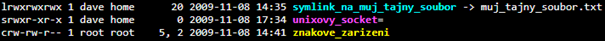

# Oprávnění v GNU/Linux systémech

-   #### Vyhledávání nastavených oprávnění a jejich porozumění

    `ls -l -a` - Výpis všech souborů (i skrytých (`-a`)) i s oprávněními (`-l`)

-   Porozumění výstupu souboru (v pořadí):

    **Oprávnění** (Vlastník, skupina, ostatní) -- **Jméno vlastníka** (dave) -- **Název skupiny** (home) -- **Velikost** -- **Čas poslední editace** -- **Název souboru**

-   První písmeno udává typ souboru:

    -   `d` - directory

    -   `l` - symbolický odkaz

    -   `-` obyčejný soubor

    -   `s` - unixový soket **a další viz lekce <u>Práce se soubory</u>...**

-   V některých případech může být také na místě posledního písmene v části oprávnění`t` (sticky bit) - Znamená to, že pouze vlastník souboru nebo adresáře může mazat nebo přejmenovat (např.: /tmp)

    - `chmod +t soubor.txt` - přidá sticky bit k soubor.txt
    
      

-   #### Číselný a písemný zápis práv v Linuxu

  | Právo | Význam u souboru | Význam u adresáře              |
  | ----- | ---------------- | ------------------------------ |
  | r (4) | Čtení souboru    | Čtení názvů obsažených položek |
  | w (2) | Zápis do souboru | Vytváření souborů a adresářů   |
  | x (1) | Spuštění souboru | Vstup do adresáře              |
  
-   Změna práv i pro celé adresáře a jejich podadresáře:

    -   `chmod -R 777 adresar/` - Rekurzivně změní práva adresar/, slouží k tomu přepínač -R

- Možnost měnit práva jak pomocí čísel a písmen, tak lze taky pouze přidat nebo odebrat práva konkrétnímu vlastníkovi / skupině / ostatním (u/g/o+rwx)

  - `+` přidává práva, `-` odebírá práva, `=` přiřazuje

  - `chmod o+rx soubor.txt` - Příklad syntaxe, kdy ostatním přiřadíme právo na čtení a spuštění

  - `chmod g-x soubor.txt` - Příklad syntaxe, kdy odebereme právo na spuštění souboru pro skupinu

  - `-v / -c` - Vypíše nám po ukončení příkazu, co se vlastně změnilo

    

  #### **Uživatelé**

-   <u>Vytvoření uživatele</u>

    -   `adduser mike` - Přidá uživatele mike a poté jsme vyzváni k:
    -   Přidání a potvrzení hesla,
        
    -   Volitelným údajům, ty můžeme přeskočit pomocí klávesy Enter
        
    -   A potvrzení všech údajů, zde stačí pouze napsat Y a potvrdit klávesou Enter
    
- <u>Editace uživatele</u>

  Jakmile je uživatel vytvořený, tak s ním můžeme dále pracovat. Můžeme měnit jeho práva v různých situacích, přidávat ho do skupin, které dle nějaké hierarchie spravujeme apod. Níže jsou nějaké příklady příkazů, s kterými se v případě editací uživatelů setkáte.

  -   `su` - Využívá se pro změnu z jednoho uživatele na druhého

  -   `usermod -a -G sudo mike` - Přidání uživatele mike do skupiny sudo

  -   soubor `/etc/passwd` - Informace o uživatelích systému (ID, UID, GID, interpretace příkazů - Shell zajištující interakci uživatele se systémem)

      -   V tomto souboru ovšem nejsou pouze informace o uživatelích, ale také o službách. Rozdíl mezi uživatelem a službou rozeznáme například tak, že jestliže je v daném řádku /bin/false, tak se jedná o službu

- <u>Odebrání uživatele</u>

  Jsou i situace, kdy již nám například nějaký zaměstnanec odejde a je čas zahladit stopy po jeho aktivitách v systému. V takovou situaci uživatele odstraníme.

  -   `sudo deluser mike` - Odebere uživatele, ale POZOR! bez jeho adresářů apod.

  -   `sudo deluser --remove-home / -r mike` - Pokud chceme odebrat uživatele včetně jeho domovského adresáře, tak použijeme parametr --remove-home nebo jeho zkrácenou verzi -r

  -   Na některých místech se můžete setkat s userdel místo deluser, ale jedná se o stejný příkaz

- <u>Změna vlastníka souboru</u>

  Pokud chceme změnit vlastníka souboru, tak k tomu použijeme příkaz `chown` (vychází z anglického change owner)

  -   `chown jmeno_uzivatele soubor.txt` - Změní vlastníka na jmeno_uzivatele u soubor.txt

  -   `chown -R ...` - To stejné co výše, ovšem rekurzivně 

  -   `chown -c / -v` - Vypíše nám, co jsme vlastně změnili

  - `chown dave:home adresar/` - Změní vlastníka i skupinu daného souboru / adresáře (: je oddělovač) -- viz výše

    

  #### **Skupiny**

-   <u>Vytvoření a správa skupiny</u>
-   Při vytváření / mazání skupiny se jedná o editaci souboru `/etc/group`
    
-   Smazání - `delgroup jmenoskupiny / deluser --group jmenoskupiny`
    
-   Vytvoření - `groupadd \[-g GID\] \[-r\] \[-f\] nazev_skupiny`
    
    -   -g nastaví GID -- nejnižší volná nad 500 (pod 500 pro sys. Skup.)
    
    -   -r pro systémové skupiny (nepoužívá se -g, přidělí se GID samo)
    
    -   -f pokud skupina existuje, přepis se nestane
-   <u>Přidání uživatele do skupiny</u>
-   `useradd -G jmenoskupin jmenouzivatele` - Vytvoří uživatele a přidá do skupiny
    
-   `usermod -a -G jmenoskupiny jmenouzivatele` - Přidá existujícího uživatele do skupiny
    
-   `usermod -g jmenoskupiny jmenouzivatele` - Změní primární skupinu uživatele 
    
-   `gpasswd -a user group -` Alternativa přidávání
-   <u>Odebrání uživatele ze skupiny</u>
    -   `deluser user group` - Nejčastěji využívaná forma odebrání uživatele
    -   `gpasswd -d user group`  - Alternativa odebrání
-   <u>Výpis uživatelů ve skupině</u>
    -   `soubor /etc/group` - Seznam všech skupin, nastavení a členů
-   <u>Změna skupiny u souboru / adresáře</u>
-   `chown dave:home adresar/` - Změní vlastníka i skupinu (: je oddělovač) - viz výše
    
-   `chown :home adresar/` - Změní pouze skupinu

