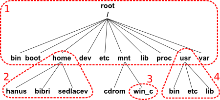

# Práce se soubory

#### a)  **<u>Operace se soubory / složkami</u>**

- **Vytváření**

  V předchozí kapitole s názvem Základy textového rozhraní byla řeč o přepínačích a argumentech. Při práci se soubory se dá velmi dobře tato znalost uplatnit, jelikož díky přepínačům je možné nejen soubory vytvářet, mazat apod., ale například také měnit rovnou práva k souborům nebo jejich čas poslední změny.

  `touch soubor.txt` - Vytvoří soubor s názvem soubor.txt

  `touch -d '15 January 2003 21:07' soubor.txt` - Nastaví datum poslední změny u soubor.txt, zároveň pokud neexistuje, tak ho vytvoří

  `mkdir -m 755 adresar` - mkdir slouží k vytvoření adresáře, pomocí přepínače -m rovnou nastavíme práva

- **Mazání**

  `rmdir adresar / rm -d adresar` - Dvě možnosti smazání adresáře

  `rm soubor.txt` - Smazání souboru

  `rm -r` - Slouží k rekurzivnímu smazání adresářů - potřeba v případě, že adresář není prázdný

  `shred` - Bezpečně maže soubory (nejdříve přepíše jejich obsah)

  

- **Vypisování (v případě složek i s detaily a skrytých souborů)**

  `file /tmp/ /etc/passwd 48506.py` - Zjištění informací o daném souboru

  `ls -l -a` - Konkrétnější výpis všech souborů a adresářů ve složce. Zahrne i práva k souborům a větší množství informací o nich (-l) a skryté soubory (-a)

  `ls -n -d */` - Pouze všechny složky na daném místě, díky -n nebo -l podrobnější informace

  

- **Kopírování**

  `cp -i file.txt file_cilovy.txt` - Nejčastější způsob syntaxe, pomocí -i dostaneme zpětnou vazbu, zda-li chceme přepsat soubor, pokud již na dané cílové adrese existuje

  `cp -v file.txt file_cilovy.txt` - Ukáže co se kam kopírovalo

  `cp file.txt /adresar` - Zapíše do adresáře

  `cp -R slozka slozka_backup` - Zkopíruje složku i s obsahem složky (rekurzivně)

  `rsync -a` - Také možnost kopírování, lze i přes vzdálené umístění

  

  Pro vzdálené kopírování souborů také existuje příkaz scp, jeho syntaxe se může zdát komplikovaná, ale jeho využití v praxi je velmi časté v případě kopírování například na server nebo ze serveru ke klientovi.

  ```
  scp [OPTION] [user@]SRC_HOST:]file1 [user@]DEST_HOST:]file2
  ```

  

- **Přesouvání**

  `mv soubor.txt jiny_nazev.txt` - Příkaz mv může mít i jiné využití, než pouze přesouvání souborů. V tomto případě například umí přejmenovat soubor

  `mv soubor.txt /mnt/data` - Přesune soubor.txt do adresáře /mnt/data

  `mv adresar adresar2/adresar3` - Pomocí mv lze také přesouvat adresáře do dalších adresářů

  

  Často používané přepínače k přepisování:

  | **-f** | Povolí přepis                                                |
  | ------ | :----------------------------------------------------------- |
  | **-i** | Ptá se, zda může přepsat                                     |
  | **-v** | **Vypíše, co bylo provedeno (bývá i u mnoha jiných programů)** |
  | **-n** | Zakáže přepis                                                |

  

#### b)  **<u>Navigace v adresářové struktuře</u>**



| Adresář | Vysvětlení                                                   |
| ------- | ------------------------------------------------------------ |
| /bin    | Základní programy (binárky) = aplikace, možnost využití běžnými uživateli po startu (cp, mv apod.) |
| /sbin   | Stejné jako /bin, ovšem pouze pro administrátora             |
| /boot   | Soubory zavaděče a jádra potřebně při spouštění systému      |
| /etc    | Konfigurační soubory globální a systémové                    |
| /home   | Domovské adresáře jednotlivých uživatelů                     |
| /root   | Domovský adresář administrátora root                         |
| /tmp    | Dočasné soubory                                              |
| /mnt    | Výměnná média, zvuk, flashdisk apod.                         |
| /usr    | Instalace všech aplikací, read-only soubory, dokumentace k uživatelům, knihovny atd. |
| /var    | Obsahuje data měněná za normálního běhu systému              |


- **Navigace pomocí relativních a absolutních cest**

  <u>Vysvětlení:</u>

  -   Absolutní cesta = Cesta od nejnižší úrovně v počítači k mnou hledané destinaci
  -   Relativní cesta = Cesta od aktuálního adresáře k nějakému adresáři na vyšší vrstvě, než se aktuálně nachází

  `pwd` - Absolutní cesta k aktuálnímu adresáři, kde daný příkaz použiji

  `cd cesta/` - Relativní cesta z aktuálního adresáře pro přesunu na adresář výše

  `cd absolutnícesta/` - Stejně jako lze pro přesun využít relativní cesty, tak s absolutní cestou mohou být někdy věci jednoduché. Ovšem pozor na absolutní cesty, někdy je vhodnější používat relativní a to především jestli se v adresářové struktuře pohybuji výše. Jestliže například ve scriptu využiji absolutní cesty tak daný skript nepůjde použít mimo mé zařízení.


- **Navigace pomocí zkratek \~, - a ../**

  `cd` - Jestliže použijeme příkaz cd bez jakéhokoliv upřesnění, tak se vždy dostaneme do našeho domovského adresáře

  `cd ..` - Přesun v adresářové struktuře o úroveň níže

  `cd /` - Lomítko značí root adresář

  `cd ~` - Přesun do adresáře domovského (Vlnovka = tilda) (Alt+126)


#### c)  **<u>Editace pomocí nano/pico/micro/vim</u>**

​	Pro editaci obsahu souborů existuje mnoho programů. Nejčastěji se setkáme s programem [nano](https://linuxize.com/post/how-to-use-nano-text-editor/) a [vim](https://opensource.com/article/19/3/getting-started-vim). 

- Pro zjištění více informací o souborech nebo příkazech se také často setkáte s:

  - `type` - Specifikuje typ příkazu
  - `file` - Analyzuje informace o souboru

  Při analyzování nějakých souborů můžeme také narazit na písmena, které se nachází těsně před písemnou reprezentací práv k daným souborům. Tyto písmena definují typ souboru.

- <u>Typy souborů:</u>

  - `-` - normální soubor

  - `d` - adresář

  - `l` - symbolická odkaz

  - `c` - znakové zařízení

  - `b` - blokové zařízení

  - `p` - pojmenovaná roura
  
    

#### d)  <u>**Metadata**</u>

​	Metadata popisují strukturu systému souborů a nesou další služební a doplňující informace, jako je velikost souboru, čas poslední změny souboru, čas 	posledního přístupu k souboru, vlastník souboru, oprávnění v systému souborů, seznam bloků dat, které tvoří vlastní soubor atd.

