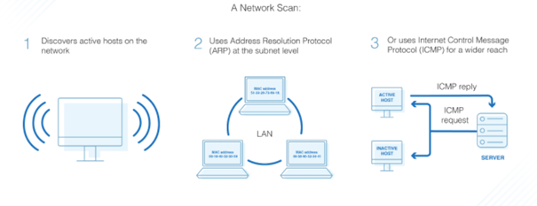

# Průzkum a sken sítě

-   Sken sítě je postup pro identifikaci aktivních zařízení v síti pomocí funkce nebo funkcí v síťovém protokolu

-   Důvodem je údržba, správa a zabezpečení sítě pomocí dat získaných díky skenu

#### **Provedení základních úkonů skenování sítě za pomoci programu nmap:**

`nmap [<Scan Type> ...] [<Options>] {<target specification>}`


Nmap rozlišuje privilegovaný režim, tudíž je vhodné používat sudo. Například v případě, že Nmap zjišťuje stav cílového počítače, tak používá ICMP echo (ping), ale s použitím sudo je využíván také protokol ARP.

Jedna z naprosto elementárních situací, kdy využijeme funkcí Nmapu je získaní dostupných (up) zařízení v daném subnetu:

-   `nmap (-sP / -sn) 172.44.2.0/24 ` Tyto přepínače zajišťují skenování pouze zda je zařízení up/down. 172.44.2.0 Adresa s podsítí 24


Nmap také disponuje možností nastavit rychlost skenování. Jsou situace, kdy je vhodnější zvolit pomalejší nebo naopak rychlejší skenování sítě oproti standardu.

Tento parametr u Nmapu nastavujeme pomocí přepínače `-T` a jeho možnosti jsou: `[paranoid, sneaky polite, normal (výchozí), aggressive, insane]`

- Vysoká rychlost zatíží síť a server **x** Nízká rychlost může obejít IDS


**Získání seznamu otevřených TCP / UDP portů na dané adrese / subnetu:**

Jakmile oskenujeme nějakou síť, tak si můžeme všimnout, že každý port má nějaký stav. Stavy jsou celkově 4:

1. **Open** = Aplikace na cílovém zařízení naslouchá připojení/paketům na daném portu
2. **Closed** 
3. **Filtered** = Firewall nebo zařízení pro filterování paketů brání vrácení stavu portu
4. **Unfiltered** = Port je dosažitelný, ale Nmap nemůže určit zda je open/closed


Ve výchozím stavu Nmap skenuje 1000 nejpoužívanějších portů. To ovšem neznamená, že nemůžeme určit větší rozsah skenování nebo dokonce pouze konkrétní porty a protokoly.

-   Všech 65535 portů: `nmap -p- <target>` (`-p-` specifikuje všechny porty)

-   Konkrétní porty: `nmap -p U:53,67,T:21,80,135 <target>` (-p - sken určitých portů, U:53,67 - sken UDP portů 53,67, T:21,80,135 - sken TCP portů 21,80,135)

-   Rozsah portů: `nmap -p 1-12000 <target>` (skenuje porty 1-12000)

-   Provedení skenování portů u zařízení i v situaci, že zařízení neodpoví na **ICMP echo** (Host není up): `nmap -Pn <target>` 

-   Provedení service skenu - rozpoznání služby, která na portu naslouchá: `nmap -sV <target>`

-   Provedení rozpoznání operačního systému na cílovém zařízení: `nmap -O <target>`


**Ověření dostupnosti zařízení pomocí ICMP echo**

Ověření dostupnosti provedeme pomocí programu ping. Ve výchozím nastavení v Linuxu ping pojede dokud ho nezastavíte. Ve Windowsu proběhne ping 4x a poté se ukončí. To ovšem neznamená, že v Linuxu takové nastavení není možné. Počet pingů můžeme nastavit pomocí přepínače `-c`. Zároveň je důležité si zapamatovat, že ICMP není pouze "pingovací protokol".

ICMP slouží jako protokol k předávání metadat nebo ke komunikací síťových zařízení, které nejsou popsány jinými protokoly. ICMP má své číslování požadavků a ping je pouze jeden z nich (8). 

`ping <ip_address>`


**Získání MAC adresy zařízení na LAN**

-   Přidání adresy do ARP tabulky (zároveň ověří dostupnost): `ping <ip_address>`

-   Výpis ARP tabulky: `ip neigh` -> najdu si IP adresu, na kterou jsem vyslal ping a zjistím z ARP tabulky MAC adresu



#### **Práce s programem netcat**

**Navázání TCP / UDP spojení na dané IP adrese a portu**

- Naváže **TCP** spojení s danou IP adresou a portem: `nc <address> <port>`

- Naváže **UDP** spojení s danou IP adresou a portem: `nc -u <address> <port>`

  

**Otevření TCP / UDP spojení na dané IP adrese a portu**

> 0.0.0.0 = všechny adresy na lokálním zařízení

-   Otevře **TCP** spojení na dané IP adrese a portu: `nc -l <address> <port>`

-   Otevře **UDP** spojení na dané IP adrese a portu: `nc -l <address> <port>`


**Přenos dat mezi dvěma zařízeními**

1. Začneme poslouchat na určitém portu: `nc -l -p <port> ` 
2. Navážeme spojení: `nc <address> <port>`

Co napíšeme na 2., tak se ukáže na 1. po navázání spojení, stejně tak to může fungovat s přenosem souborů apod.

1. Poslouchání na určitém portu s ukládáním outputu do souboru PC1: `netcat -l 1234 > filename.out`

2. Na druhém počítači připojení na poslouchací počítač s daty ze souboru PC2: `netcat adresaPC1 1234 < filename.in`

   

Alternativní možností pro přenos dat mezi dvěma zařízeními je SCP:

```
scp [OPTION] [user@]SRC_HOST:]file1 [user@]DEST_HOST:]file2
```

