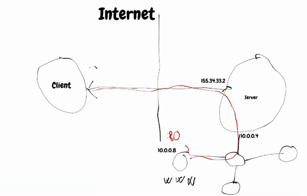
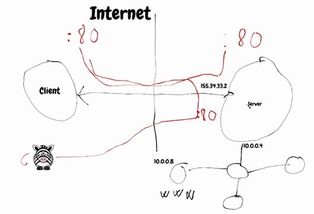

# Síťové protokoly

<u>Co je síťový protokol?</u>

-   Konvence nebo standard, podle kterého probíhá elektronická komunikace a přenos dat mezi dvěma koncovými body.

1. **DHCP**

   -   *Dynamic host configuration protocol* - Přiděluje konfiguraci klientovi v síti (IP adresa, maska, výchozí brána apod.)

   -   Fáze DHCP handshake

       -   **DISCOVER** - Klient se doptává se svou MAC adresou na broadcast v síti

       -   **OFFER** - Pokud je tam DHCP, tak odpoví se svou MAC adresou a nabídkou IP adresy

       -   **REQUEST** - Pokud není duplicita na síti klient odpoví kladně

       -   **ACKNOWLEDGE** - Potvrzení ze strany serveru

   -   Co znamená DHCP Server a Klient?

       -   **Server** - Řídí klienty na síti, deamon

       -   **Klient** - Komunikují s DHCP serverem, existuje i na základní desce - dá se bootovat po síti, není součástí OS **x** a pak je systémový - součástí OS

3. **DNS**

   -   *Domain name service* - Protokol, co slouží k přeložení IP adres na doménové jména

   -   **`resolv.conf` - konfigurační soubor na DNS v Linuxu**

   -   DNS je přiděleno DHCP serverem, pokud v síti je

   -   Pokud DNS server nefunguje jak má, tak můžeme tento problém jednoduše analyzovat. Každé doménové jméno pod sebou skrývá IP adresu a pokud při pokusu pingovat doménové jméno ping selže, ale při pingu na jeho IP adresu vše proběhne hladce, tak je problém s DNS serverem.
       -   Např.: `ping google.com` - Selže 
       -   `ping 8.8.8.8` - Kladná odezva -> DNS server nepřekládá 8.8.8.8 jak by měl

4. **NTP**

   -   NTP protokol zajišťuje synchronizaci času. Klient se dotáže NTP serveru na čas, ten mu odpoví a klient si čas, který dostal v odpovědi, nastaví v systému
   -   **`/etc/ntp.conf`** - Konfigurační soubor na NTP v Linuxu
   -   Jestliže NTP server nefunguje správně, tak mohou nastat vážné problémy. Jestliže čas na klientovi nefunguje správně, tak mohou vzniknout problémy s certifikáty nebo nastávají výpadky služeb.
       -   Např.: Chrome - má seznam různých pravidel, kdy vás nepřipojí na stránku, která má být HTTPS, když je jako HTTP a zablokuje přístup

   -   Role NTP Klienta a NTP Serveru

       -   Server poskytuje klientům na požádání přesný čas s doplňujícími informacemi (svoji vrstvu, přesnost času atd.) Naopak klient získává přesný čas od jednoho či více serverů, a to k synchronizaci svých vlastních hodin.
   -   Princip útok jménem **time shifting**
       -   Jak již bylo výše řečeno, problémy s časem mohou způsobit vážné problémy. Existuje druh útoku právě na službu NTP s názvem **time shifting**
       -   Principem tohoto útoku je donucení přenastavení klientovo systémového času pomocí MITM útoku, kdy se útočník snaží vydávat za NTP server

       -   V dnešní době provést tento útok je velmi náročné, jelikož systémy jsou velice restriktivní. Systém dovolí změnit čas pouze 1x za 15 minut a to maximálně o 125ms. Nejvíce restriktivním systémem vůči tomuto útoku je Windows OS.

5. **ARP**

   -   Jeden z nejzákladnějších síťových protokolů. Slouží k mapování MAC adresy k IP adrese.

   -   Když chceme komunikovat s IP adresou, tak na lokální síti potřebujeme jejich MAC adresu

   -   Pokud chceme získat aktuální záznamy v ARP tabulce, tak v Linuxu využijeme příkazu `ip neigh`

       -   `sudo ip neigh flush dev eno1`

       -   `ip n`

       -   `watch ip n | grep REACHABLE`

       -   `nmap -sn` - Názorně je vidět ve Wiresharku, jak se odpovídá na MAC adresy pingu

6. **ICMP**

   -   Nejedná se pouze o protokol, který umí tzv. pingovat. Protokol slouží k předávání metadat a ke komunikací síťových zařízení, které nejsou popsány jinými protokoly. Umí diagnostikovat síť a změny, které se v ní odehrávají.
   -   ICMP požadavky jsou různě číslované (8 - ping, 5 - redirect message) - [Kompletní seznam](https://www.iana.org/assignments/icmp-parameters/icmp-parameters.xhtml)
   -   Ping na LINUX - Ve výchozím nastavení jede do nekonečna
       -   Pokud chceme omezit počet pingů, využijeme k tomu přepínač `-c` -  (`ping -c 5 {IP_ADDR}`)
   -   Ping na Windows ve výchozím nastavení "pingne" 4x

7. **SSH**

   -   Způsob vzdáleného připojení na terminál. Předchůdcem protokolu SSH byl telnet, ten ovšem nebyl bezpečný a proto vznikl jeho nástupce - SSH (Secured shell protocol)

   -   **<u>Použití SSH</u>**:
       -   Použití SSH pro přihlášení se na vzdálený server

           -   `ssh -p {cisloportu} uzivatel@IP`

       -   [Vzdálené a lokální tunelování](https://www.tecmint.com/create-ssh-tunneling-port-forwarding-in-linux/)
       -   **Vzdálené:**
           -   Slouží k situaci, kdy se potřebuji dostat na konkrétní službu, která vystupuje pod veřejnou IP adresou Serveru
       -   Příkladný syntax: `ssh -L localhost:8080:10.0.0.8:80 root@155.34.33.2`
           -   Další užitečné přepínače:
           -   -f = Spustí na pozadí
               -   -N = Zajistí, že se nespustí žádný příkaz na serveru a bude se jednat pouze o forward k té dané službě
           
           
           -   **Lokální:**
       -   Klient, co chce skrze server poskytnout službu, tak přes nějaký port otevře službu směrem na server. Klienti, co se pak připojí na server, tak se přes SSH tunel forwardnou ke klientovi, co službu nabízí
           -   Příkladný syntax:`ssh -R 52.194.1.73:8080:localhost:80 host147.aws.example.com`
           
           
       
   -   Instalace a konfigurace openssh serveru

       -   `apt install openssh-server`

       -   `systemctl start ssh`

       -   `systemctl enable ssh` - Bude se spouštět po startu

       -   `nano /etc/ssh/ssh.config`

       -   Možnosti odkomentovat v souboru `/etc/ssh/ssh.config` různé části souboru (příkazy), tím můžeme různě konfigurovat openssh server. Jedná se v podstatě o seznam pravidel, s kterými můžeme v tom daném souboru pracovat.

       -   Např.: <u>PermitRootLogin, ForwardX11</u> - I bez GUI lze přenést grafický výstup přes SSH na jiný zařízení, ale běží to fakticky na tom zařízení bez GUI

       -   Může donutit uživatele používat speciální šifrování, různé porty apod.

8.  **RIP**

    -   Směrovací protokol umožňující routerům komunikovat mezi sebou a dynamicky reagovat na změny topologie počítačové sítě

    -   Využívá hop count (Počet přeskoků)
