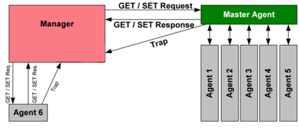

# Síťový monitoring

-   **Síťový monitoring** je použití určitého systému k neustálému sledování počítačové sítě, zda neobsahuje pomalé nebo selhávající komponenty, a který upozorní správce sítě v případě výpadků nebo jiných potíží.

-   Zatímco **IDS** monitoruje síťové hrozby z venku, systém pro síťový monitoring sleduje výpadky či problémy uvnitř sítě.

-   Právní regulace - někdy nutnost data všechny zahodit apod. nutnost znát regulace

-   **Rotace logů** = uvolňování místa pro nové logy a vyhazování starých logů

#### **Druhy síťového monitoringu**

-   **Události OS:**
    -   Zabezpečení kanálu - Pomocí logů apod.
    
    -   Unix - auditd
    
        -   Služba běžící na pozadí v rámci jádra, v konfiguračním souboru říkáme, na co by si měl dávat auditd pozor při běhu OS
    
        -   Jsou tam různé shutdowny, poweroffy apod. viz samotný soubor, který je okomentovaný
    
    -   Win - Elastic winlogbeat
    
    -   Metrika
    
        -   Vytížení zdrojů zařízení
    
        -   Objem průchozích dat
    
    -   Dostupnost
    
    -   Aplikační logy
    
        -   Informace o běhu aplikace
    
        -   Příklady
    
            -   Logy webové aplikace - jednotlivé requesty & responsy
        -   Logy různých služeb (např. DHCP, SSH, Kerberos atp.)

    -   **Co sledovat?**
        -   Přihlašování uživatelů (včetně pokusů)
        
        -   Změna stavu služeb
        
        -   Změna HW zařízení (připojení/odpojení perifierie atp.)
        
        -   Bezpečnostní události (překročení pravomocí uživatele/procesu atp.)
        
        -   Procesy (vytvoření, zánik, změna stavu atp.)

- **Protokoly:**

  -   Protokolů souvisejících se síťovým monitoringem je mnoho, avšak vysvětlíme si pouze jedny z nejpoužívanějších
  -   **SNMP**:
      -   Simple Network Management Protocol

      -   Jeden z nejpoužívanějších protokolů pro monitoring sítě

      -   Port 161

      -   Běží na aplikační vrstvě

      -   Používá metodu call-and-response k zjišťování stavu monitorovaných zařízení, či stavu jejich konfigurace

      -   Používán ke kontrole zařízení od switchů až po tiskárny

      -   **SNMP Trap** = Varovná zpráva, že je něco v nepořádku, může být i když dochází toner v tiskárně.

  

  -   **ICMP:**
      -   Internet Control Message Protocol

      -   Běží na síťové vrstvě

      -   Routery, servery atd. používají ICMP protokol k odesílání informací o IP operacích a chybových hlášek v případě selhání zařízení

      -   *ping* (echo request, echo reply)

-   **Packet sniffers:**
    -   **Hardware:**
    
        -   Navržen pro připojení přímo do fyzické sítě
    
        -   Užitečný při pokusu o zobrazení provozu konkrétního segmentu sítě
    
        -   Uloží nebo předá shromážděná data
    
        -   Do 100mb je možný hardwarově uříznout kabel a napojit ho k sobě
    
    -   **Software** (většina):
    -   Využití promiskuitního režimu (režim síťové karty, který umožňuje zachytávat komunikaci, která není přímo určena pro dané zařízení)
        
    -   Zaznamená veškerý provoz a použije podle požadavku softwaru.
        
    -   Mprobe
        
    -   Pmacct
        
    -   **Elastic**.**co/beats/** - přehled sond, které nabízí <u>elasticsearch</u>
           -   **Filebeat** - distribuce přístupů k serverů ve světě
                  -   Vezme soubor, sleduje změny a odesílá
        
        -   **Packetbeat**
            -   Umí poslouchat na interface atd.
        -   **AuditBeat**
            -   Monitoruje OS
    
    -   **Logstash** - Sada pravidel upravující data (filtry, přidání, úpravy, odebírání), využívá se k zjištění původu země IP například
    -   **Kibana** - Vizualizace pro data, jejich filtrace, grafy, mapy apod., Jedná se o balíček mnoha funkcí, včetně kontroly nad sítí počítačů, jejich vytížení, downtime, uptime apod.

#### **Analýza zachycených dat**

-   Na co si dáváme pozor při analyzování:

    -   Detekce aktivity ransomwaru

    -   Monitorování exfiltrace dat / aktivity na internetu

    -   Monitorování nepovolených přístupů k souborům na file serverech nebo v databázích

    -   Sledování aktivity uživatele v síti

-   **Software:**
    -   **Wireshark**:
        -   Možnost analýzy dat real-time, nebo ze souboru
        
        -   Používá pcap knihovnu pro zachytávání paketů
        
            -   Windows = WinPcap
        
            -   Linux = Libcap
        
        -   Zobrazení i zachytávání dat může být upraveno pomocí filtrů a zbylých různě nastavitelných parametrů.
        
    -   **TCPdump:**

        -   Nástroj příkazové řádky pro monitorování a správu sítě, který zachytává TCP/IP pakety v reálném čase.

        -   Stejně jako Wireshark používá knihovnu libcap = výstup TCPdump je kompatibilní s Wiresharkem a naopak
