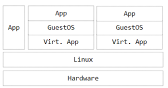
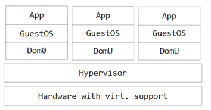
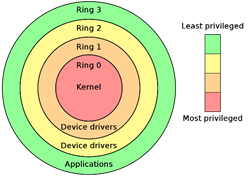
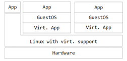
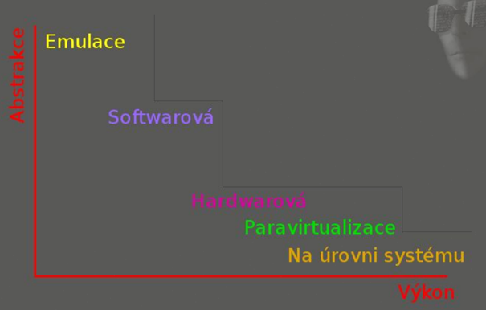

# Virtualizace

Označení pro postupy a techniky, které umožňují v počítači přistupovat k dostupným zdrojům jiným způsobem, než jakým fyzicky existují.

Virtualizace může existovat na úrovni celého počítače nebo pouze virtuální procesory, či virtualizace operačního systému - pouze softwarová úroveň

**K čemu je to dobré?**

-   Možnost vývoje aplikací a jakéhokoliv jiného SW pro různé platformy

-   Doplnění chybějícího hardware, testování různých operačních systémů, optimalizace serverů

**Typy virtualizace**

-   **Emulace**

    -   Používá se při tvorbě softwaru pro fyzicky nedostupné procesory (např. tvorba víceprocesorového stroje na jednoprocesorovém) - **BOCHS, PEARPC**

    -   Nejpomalejší typ virtualizace, ale nejvíce univerzální

    -   Virtuální stroj simuluje celý hardware

    -   Zachovávají celkový vzhled i chování původní aplikace

    -   Díky Emulaci lze například na počítači spustit videohry, které jsou určené pro Xbox

-   **Plná virtualizace - nativní**

    -   Simulace všechny součásti počítače, pomalejší než paravirtualizace

    -   Neupravený hostovaný OS **má přímý přístup k fyzickému HW hostitelského PC**

    -   Umožňuje **snadnou přenositelnost virtuálních strojů na jiný HW** a jejich snadné zálohování - mohu spustit tuto virtualizaci jednou na PC s nějakým hardwarem a po druhé na úplně jiném bez nutnosti jakéhokoliv nastavení

    -   **Naprosté oddělení od fyzické vrstvy** - možnost navrhnout, kolik bude mít virtualizace paměti, kapacitu disku apod.

    -   Příkladem plné virtualizace je **VMware nebo VirtualBox**

-   **Paravirtualizace**

    - Nevytváří se kompletní virtuální HW, ale je povolena komunikace přímo s fyzickým HW -- musí se některé komponenty virtuálního a fyzického počítače shodovat (např. hostující systém bude mít stejný procesor)

    - Virtuální stroj nesimuluje hardware, ale nabízí aplikační rozhraní (API)

    - OS může rozpoznat, že běží ve virtuálním prostředí -\> často třeba modifikace OS, což je problém u OS s uzavřeným zdrojovým kódem

    - **VMware a Xen**

    - Paravirtualizace je možná jen díky tomu, že konkrétní procesory podporují více úrovní ochrany (např. Intel - 4 úrovně (okruhy ochrany = rings))

    - Nižší ringy kontrolují vyšší
    
      
    
    - V paravirtualizaci běží virtuální monitor na ring 0, OS virtuálního počítače se posune na ring 1, OS tak má stále vyšší úroveň ochrany než aplikace, ale nemůže provádět operace, které vyžadují plně privilegovaný přístup
    
    - Vysoký výkon, většinu výpočetního výkonu realizuje skutečný procesor
    
    - Vyžaduje instalaci ovladačů na hostitele a hosta, popřípadě speciální úpravu OS

-   **Virtualizace na úrovni operačního systému / kontejnerová virtualizace**
    -   V rámci jednoho OS se vytváří vzájemně oddělená prostředí - kontejnery. Umožňuje například na jednom stroji provozovat několik webových serverů, aniž by bylo nutné mít pro každý z nich nainstalovaný kompletní systém
        
    -   **Nelze jednoduše přenášet mezi stroji (rozdíl oproti například Plné)**
        
    -   Menší technická náročnost a menší systémové požadavky, velká rychlost
        
    -   Nejde o opravdovou virtualizaci - používá stejný kernel, stejný OS a oddělení není úplné
        
    -   **Docker, FreeBSD Jail**

- **Schéma / porovnání nutnosti režie a výkonu jednotlivých virtualizací**

-   **Nastavení a instalace virtuálního stroje**

    -   Pro výuku na střední škole bude využíváno především virtualizace operačních systémů. Nejčastěji především distribucí Linuxu. Pro tyto účely je nejlepší volbou **VirtualBox.**
    -   K instalaci je potřeba `.iso` instalační soubor daného systému. Při nastavování si můžeme navolit velikost paměti, kterou si operační systém zabere a stejně tak i počet jader procesoru apod.
    -   Více [zde](https://www.youtube.com/watch?v=x5MhydijWmc)

-   **Využití virtualizace při analýze škodlivého softwaru**

    -   Virtualizace je vhodná jako testovací prostředí, jelikož aplikace běžící ve virtuálním prostředí, tak nijak nemohou ohrozit hostitelský stroj (většinou - viz. níže)

    -   Bylo prokázáno, že propracovanější malware dokázaly uniknout z virtuálního prostředí (VirtualBox, Xen, KVM (Kernel-based virtual machine)...)

        -   **Pro zamezení úniku se doporučuje** zakázat sdílené složky, či přepnout do Host-only mode, také vypnout Windows defender / firewall na virtuálním stroji - ověření `nmap -PN` + antivir na fyzickém stroji, prostředí odpojeno od Internetu

    -   Migrace mezi stroji bývá rychlá, možnost zkoušet chování HW, restartovat, vypínat, odstavovat mimo síť stroje apod.

    -   **Možnost snapshotů** - Jestliže budu analyzovat nějaký virus, který by mohl narušit můj virtuální OS, tak si uložím jeho aktuální podobu a pokud se něco pokazí, tak obnovím poslední funkční zálohu

    -   Instalace vhodných nástrojů

        -   Chování: **Process Monitor, Wireshark**, ProcDOT

        -   Analýza kódu: PeStudio, Scylla, Ida Freeware

    -   Vhodné simulovat uživatelskou aktivitu

        -   Instalace prohlížeče, uložit hesla na stránky, nainstalovat aplikace, aby měl malware data, na která může zaútočit

    -   **INetSim** - Nástroj pro zprovoznění simulovaných služeb (http, DNS, SMTP atd.)

    -   <u>Na co se zaměřit při analýze?</u>
        -   Síťová aktivita, analýza procesů, analýza souborů, změny registrů Windows
    -   [Kvalitní diplomová práce na dané téma](https://theses.cz/id/warm57/4642893)
