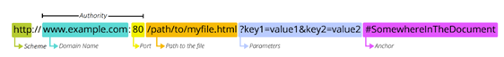

# Webové technologie

#### **HTTP protokol:**

HTTP Request příklad:

HTTP Response příklad:

##### **Struktura protokolu:**

Jaké jsou nejčastěji používané **metody** pro HTTP protokol.

-   **GET** - Získat zdroje, statickou stránku, data, v URL
-   **HEAD** - Metadata
-   **POST** - Uživatelská data na server, formuláře, není v URL
-   **DELETE**
-   **PUT** apod.

Naprosto nejčastějšími metodami je metoda GET a metoda POST. Metoda GET se odesílá přímo v URL adrese webové stránky. Slouží především k odeslání necitlivých dat. Metoda POST se odesílá v body (těle) HTTP požadavku. POST metoda se většinou stará o citlivá data, jako jsou uživatelské přihlašovací údaje apod.

V HTTP existuje určitá sekvence bytů, která slouží k oddělení řádek (odřádkování). Jedná se o sekvenci CRLF. CR - vrací na začátek a LF - odřádkuje. V hexadecimální soustavě je jejich reprezentací 0A0D.

Co jsou to **hlavičky** a jaký je jejich zápis?

-   Pomáhají komunikaci klienta a serveru pro dodatečné informace v http request / respond. Jedná se většinou o dodatečné informace typu cookies, datum, content-type apod.
-   Jejich struktura je vždy název_proměnné: hodnota
-   Například: **Connection: value**
-   Často používané hlavičky: Connection, Content-Length, Content-Type, Keep-Alive, Cookie, Set-cookie apod.

Hlavička **Host** a termín **VirtualHost**

-   Hlavička Host definuje, která doména je na IP adrese ta na kterou se chceme připojit. Jelikož pod jednou IP adresou může vystupovat více domén. Takže se vždy uvádí jak doména a IP adresa tak i hlavička **Host**
-   **VirtualHost** - Webový server, kde je definováno, co se nachází na které doméně

**Cookies** a jejich funkce

- Data, která jsou perzistentně v browseru a jsou odesílané s každým požadavkem. Vázané na doménu. Slouží serveru pro identifikace požadavků, uživatelů apod.

- Mají své expirační doby, přepínače, které určují například to, zda-li mají být cookies dostupné pro JavaScript

- Lze je mazat a přidávat, server posílá Set-cookie hlavičku - říká browseru, ať si nastaví tuto konkrétní cookie do <u>cookie storage</u> (cookies může být i více)

  

HTTP požadavky jdou vytvářet i přímo v terminálu. Například, pokud chceme získat základní HTTP data z nějaké webové stránky, tak to pomocí programu netcat uděláme takto:

-   `nc bezpečnost.ssps.cz 80` - Získat basic HTTP data

-   `GET / HTTP/1.0`

**Struktura URL Adresy:**

-   **SCHEME:** Říká, jaký protokol budeme používat pro přístup (http, https, mailto:, ftp:)

-   **DOMAIN NAME:** Přeložená IP adresa na doménové jméno

-   **PORT:** 

-   **PATH TO THE FILE:** Cesta k danému souboru, co se má interpretovat

-   **PARAMETERS:** Data, co chceme předat webové aplikaci (klíč=hodnota), & - funguje jako separátor. Pokud máme nějaké speciální znaky (?,#,=,&), které mají být součástí parametru, aby nevznikla chyba, tak se jejich ASCII hodnota zapisuje mezi procenta - %ASCII% - [volitelné]

-   **ANCHOR:** „bookmark", Odkáže přímo na nějaké místo v tom daném dokumentu definovaném v path - [volitelné] (Typické u například restaurací, které mají veškerý webový obsah na jedné stránce)

**Fuzzing**

Jedná se o automatizovanou techniku testování softwaru (v tomto případě webových stránek), která na vstup poskytuje neočekávaná data. Na fuzzing nejčastěji budeme používat programu [wfuzz.](https://wfuzz.readthedocs.io/en/latest/)

Jedna ze situací, kdy člověk fuzzingu využije je situace, kdy se snaží odhalit obsah webové stránky, na kterou není nijak odkazováno. V takovou chvíli je možnost využít `wfuzz`, `OWASP` nebo `burpsuit`.

- burpsuite - Oproti wfuzz, tak nabízí GUI, filtrování pomocí status kódů apod., bohužel pouze kvalitní je pouze PRO verze (bez ní 1 požadavek / sekunda)

- V burpsuite = Intruder, payloads - V intruderu zadáme webovou stránku a hledáme nejčastější cesty, které se na stránkách vyskytují, ale například pro tuto konkrétní webovou stránku nemusí být na ní jakýkoliv proklik.

- **OWASP - ZAP** - Také se dá využívat pro fuzzing, nemá omezení jako burpsuite na 1pož./sec

  

**HTTP Proxy**

V případě HTTP Proxy se nejčastěji setkáte s dvěma termíny:

1. **<u>Interception proxy</u>** - Umožňuje pozastavování HTTP požadavků a jejich upravování. Po jejich úpravě je teprve požadavek odeslán.
2. **<u>Reverse proxy</u>** - Jdou přes ní veškeré požadavky, které se poté logují

V **BurpSuite Community Edition** lze nastavit proxy tak, aby skrz právě burpsuite byly odesílány HTTP požadavky z browseru a my s nimi mohli manipulovat.

Jestliže tohoto chceme docílit, najdeme si **Proxy -> Options** a v options nastavíme interface, na kterém budeme naslouchat a zaškrtneme running.

Poté, co jsme úspěšně nastavili BurpSuite, tak se přesuneme do našeho prohlížeče. V případě Linuxu to většinou bude **Firefox**, kde si v nastavení najdeme nastavení Proxy a zaškrtneme **manual proxy configuration + Use this proxy server for all protocols**. Nastavíme samozřejmě také shodnou IP Adresu a port jako v BurpSuite.

Vše je nastaveno a v tuto chvíli, jakmile se pokusíme dostat na jakoukoliv webovou stránku, tak veškeré požadavky se nám objeví v **Proxy -> Intercept** v programu **Burp Suite**, kde s nimi můžeme dále pracovat.

**Instalace BurpSuite certifikátu do prohlížeče:**

Někdy může nastat situace, kdy BurpSuite nemá dostatečná oprávnění k čtení HTTP požadavků a browser tuto možnost blokuje. Nemůže pracovat s SSL požadavky atd. V takovou chvíli je důležité do prohlížeče importovat certifikát, který nalezneme na adrese **localhost:8080**. Po jeho stažení ho stačí pouze přesunout z adresáře přímo do okna prohlížeče a tím se certifikát nainstaluje jako autorita.

